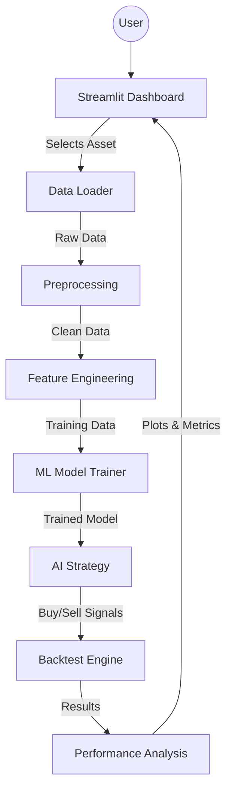

# Architecture Overview

This document illustrates the high-level architecture of the Quant Research Framework. The system is designed to be modular, separating data ingestion, logic processing, and visualization.

## High-Level Diagram

## System Architecture

### Visual Diagram (Mermaid)

### Text Diagram (Data Flow)

**1. Data Ingestion**
   `Yahoo Finance`  ->  `Loader`  ->  `Preprocessing` (Clean Data)

**2. Intelligence**
   `Clean Data`  ->  `Feature Engineering` (RSI, MA, Lags)  ->  `ML Trainer` (Random Forest)

**3. Execution (Backtest)**
   `Trained Model`  ->  `Strategy` (Signal Generation)  ->  `Engine` (Simulation)

**4. Result**
   `Engine`  ->  `Performance Metrics`  ->  `Dashboard` (User View)

## Component Descriptions

### 1. **Data Layer (`src.data`)**
*   **Loaders:** Responsible for fetching raw data from external APIs (YFinance). Handles caching to `data/raw`.
*   **Preprocessing:** Critical cleaning step. Flattens MultiIndex tables, duplicates removal, and ensures 1D Series integrity.
*   **Features:** **(New)** Engineering lab that transforms raw prices into predictive signals (RSI, Momentum, Lags, Volatility).

### 2. **Logic Layer (`src.models`, `src.backtesting`)**
*   **Model Trainer (`src.models.trainer`):** Encapsulates the Machine Learning workflow. Uses `scikit-learn` to train Random Forests to predict market direction (`target`).
*   **Strategies (`src.backtesting.strategies`):** Pure functions that input Data and output Signals.
    *   *Rules-based:* Moving Average Crossover, RSI.
    *   *ML-based:* `ml_strategy` consumes trained models to generate signals.
*   **Backtest Engine (`src.backtesting.engine`):** The core simulator. Vectorized implementation (pandas) to calculate PnL, Fees, and Portfolio Value over time instantaneously.

### 3. **Analysis Layer (`src.analysis`)**
*   **Performance:** Statisticians of the system. Calculates Risk/Reward metrics.
*   **Plotting:** Visualization utilities using `matplotlib` and `plotly` for interactive charts.

### 4. **Presentation Layer (`root`)**
*   **`dashboard.py`:** The interactive control center. Built with Streamlit, it orchestrates the entire flow based on user input, allowing for rapid prototyping without touching code.

---

## Data Flow Example (ML Strategy)

1.  User selects "SPY" and "Train Model" in Dashboard.
2.  `Loader` fetches raw OHLCV.
3.  `Preprocessing` cleans and standardizes it.
4.  `Features` generates technical indicators (X) and forward-looking targets (y).
5.  `Trainer` splits data (2010-2022) and trains a Random Forest.
6.  `Trainer` evaluates on Test Set (2023-Now) and visualizes results.
7.  *(Next Step)* `Backtester` runs the `ml_strategy` using this model to verify profitability.